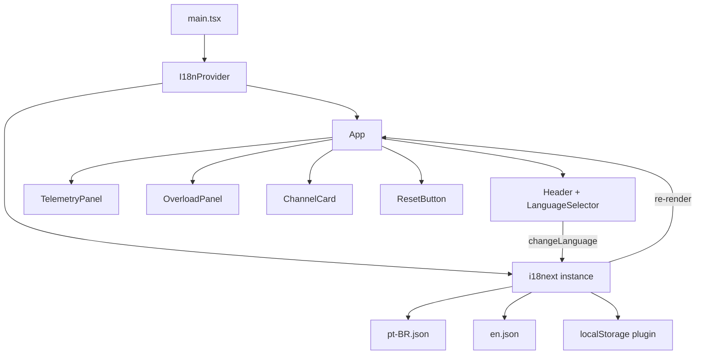

# Design Document: i18n Localization

## Overview

This design introduces internationalization (i18n) to the IoT Smart Load Balancing System frontend dashboard. The solution uses `react-i18next` (built on `i18next`) as the translation framework — the de facto standard for React i18n — providing a context-based provider, a `useTranslation` hook, and JSON-based translation files.

The architecture follows a provider pattern: an `I18nProvider` wraps the application, supplies the active locale and translation function to all components via React context, and persists the user's language preference in `localStorage`. Brazilian Portuguese (`pt-BR`) is the default locale, with English (`en`) as the secondary supported language.

### Key Design Decisions

1. **react-i18next over custom solution**: Provides battle-tested interpolation, namespace support, fallback chains, and plugin ecosystem. Avoids reinventing complex i18n logic.
2. **JSON translation files with dot-notation keys**: Flat-ish structure using nested JSON objects accessed via dot-notation (e.g., `header.title`, `channel.status.overload`). Keeps files readable and supports the requirement for dot-notation keys.
3. **Synchronous bundled translations**: Translation files are imported statically (bundled with the app) rather than loaded asynchronously. Given only two locales with modest translation volume, this avoids loading states and simplifies error handling.
4. **localStorage persistence with graceful fallback**: Language preference is stored in `localStorage`. If unavailable or corrupted, the system silently falls back to `pt-BR`.

## Architecture



### Data Flow

1. **Initialization**: `i18next` initializes with bundled translations. It reads `localStorage` for a persisted locale; if absent or invalid, defaults to `pt-BR`.
2. **Rendering**: Components call `useTranslation()` to get the `t()` function. Each `t('key')` call resolves the key against the active locale's translation file.
3. **Language Switch**: User selects a locale from `LanguageSelector`. This calls `i18next.changeLanguage(locale)`, which updates the active locale, persists to `localStorage`, and triggers a re-render of all components using `useTranslation`.
4. **Fallback**: If a key is missing from the active translation file, `i18next` returns the key itself (configured via `returnNull: false` and `fallbackLng: false` with `parseMissingKeyHandler`).

## Components and Interfaces

### New Files

| File | Purpose |
|------|---------|
| `src/i18n/index.ts` | i18next configuration and initialization |
| `src/i18n/locales/pt-BR.json` | Brazilian Portuguese translations |
| `src/i18n/locales/en.json` | English translations |
| `src/components/LanguageSelector.tsx` | Language selector dropdown component |
| `src/i18n/types.ts` | TypeScript types for locale and translation keys |

### Modified Files

| File | Change |
|------|--------|
| `src/main.tsx` | Import i18n initialization before App render |
| `src/components/App.tsx` | Use `t()` for header text; render `LanguageSelector` in header |
| `src/components/TelemetryPanel.tsx` | Replace hardcoded labels with `t()` calls |
| `src/components/OverloadPanel.tsx` | Replace hardcoded text with `t()` calls |
| `src/components/ChannelCard.tsx` | Replace hardcoded text with `t()` calls |
| `src/components/ErrorBanner.tsx` | Replace hardcoded text with `t()` calls |
| `src/components/ResetButton.tsx` | Replace hardcoded text with `t()` calls |
| `src/components/RelayControl.tsx` | Replace hardcoded text with `t()` calls |
| `src/components/OverloadFreeUptime.tsx` | Replace hardcoded text with `t()` calls |
| `src/components/ConfirmDialog.tsx` | Replace hardcoded text with `t()` calls |

### Component Interfaces

```typescript
// src/i18n/types.ts
export type SupportedLocale = 'pt-BR' | 'en';

export const SUPPORTED_LOCALES: SupportedLocale[] = ['pt-BR', 'en'];

export const LOCALE_LABELS: Record<SupportedLocale, string> = {
  'pt-BR': 'Português',
  'en': 'English',
};

export const DEFAULT_LOCALE: SupportedLocale = 'pt-BR';
export const STORAGE_KEY = 'i18n-locale';
```

```typescript
// src/components/LanguageSelector.tsx
interface LanguageSelectorProps {
  // No props needed — reads locale from i18next context
}
```

### i18next Configuration

```typescript
// src/i18n/index.ts
import i18n from 'i18next';
import { initReactI18next } from 'react-i18next';
import ptBR from './locales/pt-BR.json';
import en from './locales/en.json';
import { DEFAULT_LOCALE, SUPPORTED_LOCALES, STORAGE_KEY } from './types';
import type { SupportedLocale } from './types';

function getPersistedLocale(): SupportedLocale {
  try {
    const stored = localStorage.getItem(STORAGE_KEY);
    if (stored && SUPPORTED_LOCALES.includes(stored as SupportedLocale)) {
      return stored as SupportedLocale;
    }
  } catch {
    // localStorage unavailable — ignore
  }
  return DEFAULT_LOCALE;
}

function persistLocale(locale: string): void {
  try {
    localStorage.setItem(STORAGE_KEY, locale);
  } catch {
    // localStorage unavailable — ignore silently
  }
}

i18n
  .use(initReactI18next)
  .init({
    resources: {
      'pt-BR': { translation: ptBR },
      'en': { translation: en },
    },
    lng: getPersistedLocale(),
    fallbackLng: false,
    interpolation: {
      escapeValue: false, // React already escapes
    },
    parseMissingKeyHandler: (key: string) => key,
    returnNull: false,
  });

// Persist locale on language change
i18n.on('languageChanged', persistLocale);

export default i18n;
```

### LanguageSelector Component

```typescript
// src/components/LanguageSelector.tsx
import { useTranslation } from 'react-i18next';
import { SUPPORTED_LOCALES, LOCALE_LABELS } from '../i18n/types';
import type { SupportedLocale } from '../i18n/types';

export function LanguageSelector() {
  const { i18n } = useTranslation();

  function handleChange(event: React.ChangeEvent<HTMLSelectElement>) {
    const locale = event.target.value as SupportedLocale;
    i18n.changeLanguage(locale);
  }

  return (
    <select
      value={i18n.language}
      onChange={handleChange}
      aria-label="Language selector"
      className="..."
    >
      {SUPPORTED_LOCALES.map((locale) => (
        <option key={locale} value={locale}>
          {LOCALE_LABELS[locale]}
        </option>
      ))}
    </select>
  );
}
```

## Data Models

### Translation File Structure

Translation files use nested JSON with dot-notation access. Keys are organized by component/section:

```json
{
  "header": {
    "title": "IoT Dashboard"
  },
  "telemetry": {
    "title": "Telemetry",
    "deviceId": "Device ID",
    "uptime": "Uptime",
    "events": "Events",
    "lastUpdated": "Last Updated"
  },
  "overload": {
    "title": "Overload Status",
    "allNormal": "All channels normal",
    "channelsInOverload": "{{count}} channel(s) in overload",
    "channelLabel": "Channel {{id}}"
  },
  "channel": {
    "title": "Channel {{id}}",
    "status": {
      "overload": "OVERLOAD"
    },
    "dataUnavailable": "Data unavailable"
  },
  "relay": {
    "connected": "Connected",
    "disconnected": "Disconnected",
    "ariaLabel": "Relay {{channel}}: {{state}}"
  },
  "uptimeFree": {
    "label": "Uptime:",
    "noOverloads": "No overloads recorded",
    "withoutOverloads": "{{time}} without overloads"
  },
  "reset": {
    "button": "Reset System",
    "pending": "Resetting…",
    "timeoutError": "Reset timed out. Please try again.",
    "confirmMessage": "Are you sure you want to reset the system? This will clear all overload states and relay overrides."
  },
  "confirm": {
    "cancel": "Cancel",
    "confirm": "Confirm"
  },
  "error": {
    "dataRefreshFailed": "Data refresh failed: {{message}}",
    "dismissAriaLabel": "Dismiss error"
  }
}
```

### localStorage Schema

| Key | Value | Description |
|-----|-------|-------------|
| `i18n-locale` | `"pt-BR"` \| `"en"` | Persisted user language preference |

### Supported Locales Registry

The `SUPPORTED_LOCALES` array serves as the single source of truth for which locales are available. Adding a new locale requires:
1. Creating a new translation JSON file
2. Adding the locale to `SUPPORTED_LOCALES` and `LOCALE_LABELS`
3. Importing and registering the resource in `i18n/index.ts`

## Correctness Properties

*A property is a characteristic or behavior that should hold true across all valid executions of a system — essentially, a formal statement about what the system should do. Properties serve as the bridge between human-readable specifications and machine-verifiable correctness guarantees.*

### Property 1: Translation key lookup returns correct value

*For any* valid translation key (including nested dot-notation paths) in the active locale's translation file, calling the translation function with that key shall return the corresponding string value from the JSON file.

**Validates: Requirements 1.3, 1.7**

### Property 2: Missing key fallback returns key itself

*For any* arbitrary string that is not present as a key in the active locale's translation file, calling the translation function with that string shall return the string itself unchanged.

**Validates: Requirements 1.4, 6.4**

### Property 3: Interpolation preserves dynamic values

*For any* translation key whose value contains placeholder tokens (e.g., `{{value}}`), and *for any* parameter values provided, the translation function shall produce an output string where each placeholder is replaced by its corresponding parameter value, with the parameter value appearing verbatim (not translated or transformed).

**Validates: Requirements 1.6, 2.4, 3.3**

### Property 4: Translation completeness per locale

*For any* supported locale and *for any* translation key referenced by dashboard components, the locale's translation file shall contain a non-empty string value for that key.

**Validates: Requirements 2.2, 3.1, 6.1**

### Property 5: Translation key parity across locales

*For any* key present in any supported locale's translation file, that same key shall be present in all other supported locale translation files — the key sets across all locale files shall be identical.

**Validates: Requirements 6.2**

### Property 6: Locale selection updates active locale

*For any* supported locale, when that locale is selected via `changeLanguage`, the i18next instance's active language shall equal the selected locale.

**Validates: Requirements 4.4**

### Property 7: Locale persistence round-trip

*For any* supported locale, after selecting it (triggering persistence to localStorage), re-initializing the locale resolution function shall return that same locale as the active locale.

**Validates: Requirements 5.1, 5.2**

### Property 8: Invalid persisted locale falls back to default

*For any* string that is not a member of the supported locales set, if that string is stored in localStorage as the persisted locale, the locale resolution function shall return `pt-BR` as the active locale.

**Validates: Requirements 5.3**

## Error Handling

| Scenario | Behavior | User Impact |
|----------|----------|-------------|
| Translation key missing at runtime | `t(key)` returns the key string itself | User sees the key (e.g., `header.title`) instead of translated text — functional but degraded |
| localStorage unavailable (private browsing, quota exceeded) | `getPersistedLocale()` catches the error and returns `DEFAULT_LOCALE`; `persistLocale()` catches and silently fails | User always gets pt-BR; preference not saved between sessions |
| Invalid locale in localStorage | `getPersistedLocale()` checks against `SUPPORTED_LOCALES`; if not found, returns `DEFAULT_LOCALE` | User gets pt-BR; invalid value is effectively ignored |
| Translation file import fails (bundling error) | Since translations are statically imported, this would be a build-time error caught by TypeScript/Vite | Build fails — never reaches production |

### Error Handling Principles

1. **Silent degradation for localStorage**: Never show an error to the user for persistence failures. The app works fine without persistence — it just defaults to pt-BR each session.
2. **Key-as-fallback for missing translations**: Displaying the key is better than showing nothing or crashing. It also makes missing translations immediately visible during development.
3. **Build-time validation preferred**: A test that validates translation completeness catches issues before deployment rather than at runtime.

## Testing Strategy

### Property-Based Tests (fast-check + vitest)

The project already uses `fast-check` for property-based testing. Each correctness property will be implemented as a property-based test with a minimum of 100 iterations.

| Property | Test File | What's Generated |
|----------|-----------|-----------------|
| P1: Key lookup | `src/__tests__/i18n.property.test.ts` | Random valid keys sampled from translation file |
| P2: Missing key fallback | `src/__tests__/i18n.property.test.ts` | Random strings not in translation file |
| P3: Interpolation | `src/__tests__/i18n.property.test.ts` | Random parameter values (strings, numbers) for keys with placeholders |
| P4: Completeness | `src/__tests__/i18n.property.test.ts` | All keys from component references × all locales |
| P5: Key parity | `src/__tests__/i18n.property.test.ts` | All keys from each locale file |
| P6: Locale selection | `src/__tests__/i18n.property.test.ts` | Random supported locale from SUPPORTED_LOCALES |
| P7: Persistence round-trip | `src/__tests__/i18n.property.test.ts` | Random supported locale |
| P8: Invalid locale fallback | `src/__tests__/i18n.property.test.ts` | Random strings not in SUPPORTED_LOCALES |

**Configuration:**
- Library: `fast-check` (already in devDependencies)
- Minimum iterations: 100 per property
- Tag format: `Feature: i18n-localization, Property N: <description>`

### Unit Tests (example-based)

| Test | File | What's Verified |
|------|------|-----------------|
| Provider supplies t() and locale | `src/__tests__/i18n.test.ts` | Component inside provider can call t() |
| Default locale is pt-BR when no localStorage | `src/__tests__/i18n.test.ts` | Fresh init → pt-BR active |
| LanguageSelector renders all options | `src/__tests__/LanguageSelector.test.tsx` | All locales appear as options with native names |
| LanguageSelector shows active locale | `src/__tests__/LanguageSelector.test.tsx` | Selected value matches current locale |
| Language switch re-renders text | `src/__tests__/LanguageSelector.test.tsx` | Switching locale updates visible text |
| localStorage failure graceful | `src/__tests__/i18n.test.ts` | Mocked localStorage throws → no error, pt-BR used |

### Build-Time Validation

A dedicated test (`src/__tests__/i18n-completeness.test.ts`) will:
1. Import both translation JSON files
2. Recursively extract all keys (flattened with dot-notation)
3. Verify both files have identical key sets
4. Optionally scan source files for `t('...')` calls and verify all referenced keys exist

This ensures requirement 6.3 (build/test fails if translation file is missing a key).

